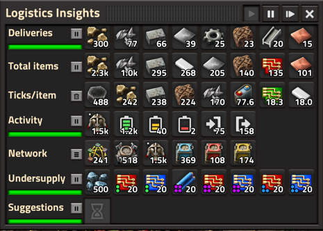
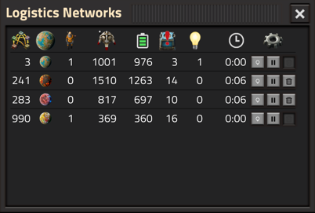

# Logistics Insights

When playing Factorio, have you ever wondered what all of your logistics bots are up to? Whether you have too many, or too few? Whether you have enough storage? Particularly in the mid game where everything is scaling up, I've found that the answers sometimes are quite surprising.

Logistics Insights can help:

- Provides actionable insights on what to do to improve your network, based on how it's performing
- Undersupply: Shows a list of the top things where demand consistently outstrips supply
- Multi-network: Helps you keep an eye on your key networks and easily navigate between them
- Multi-player: When you work together on a base, you can keep track of and help each other
- Real-time: Shows what's happening in your networks real time
- Interactive: Most things are clickable so you can easily get to the root of whatever the issue is

The main Logistics Insights window focuses on showing everything you need to know about a single bot network at a time, whether it's the one where you are or one you're looking at via the map view.

The Logistics Networks window shows all of the networks you've visited, with a few key highlights like number of bots, number of active suggestions and how many things are in short supply. You can also easily navigate between networks from here.

## How to use Undersupply information

In the Undersupply row, you can see items that have more demand than can be supplied in the network. This is useful to identify hard-to-spot bottlenecks.

If you click on an item, LI will highlight every place that requests the item, and if you right-click, it will also zoom in and focus the map view on one of them. You can repeatedly right-click to get a sense for where the problems are.

## How to use Suggestions

There are several types of suggestions, depending on what is happening in your network:

- **Build more roboports.** A common problem is that a lot of your bots are waiting to charge, which means that fewer bots are free to do useful work. Building more bots doesn't help though! Instead, build more roboports so the bots can quickly find a place to charge, without having to wait. LI will show this as a High priority suggestion if you need more than 100 additional roboports.
- **Build more storage.** If your storage is close to full, your network will work less efficiently as bots need to go further to find available storage. This suggestion shows up when your storage is 70% full, and becomes High priority when it's 90% full.
- **Build more unfiltered storage.** Filtered storage is great, but you may be running out of storage that isn't filtered. LI uses same thresholds as for total storage here.
- **Filtered storage mismatch.** If your filtered storage has items that don't match the filter, LI suggests you fix it. You can click/right-click on the suggestion to see which chests show the problem, which is otherwise hard to find.

Note that "fullness" of storage is measured by stacks, so you may have more storage available than LI suggests as it only looks for empty stacks.

## How else I use the mod

Before a base reaches megabase level, keep the Networks window open to keep an eye on whether there are a lot of things in Undersupply or Suggestions. Then, if there is an issue, click on the network to immediately move the map view there and see the main Insights window:

**In the Delivering/Total/Ticks rows**

- If some items take a disproportionate amount of time to deliver (i.e. they show up early in the Ticks/item list), consider transporting those using belts instead, or creating a source of items closer to where it's needed
- If there is some item that's being transported unnecessarily (i.e. it shows up early in the Totals list), perhaps could belt that item instead. For example, in one case I found that my bots were transporting iron ore 90% of the time, filling up my storage chests, all because I accidentally put ore in an active provider chest.
- Sometimes, a small number of items are delivered a long way, cluttering up the Ticks/item statistics. Right-click on one of the buttons to clear the history and start again.
- If you don't need part of the display right now, click the pause button to temporarily pause collecting it. Or change the setting to remove the rows entirely, which also makes the window smaller.

**In the Activity row**

- If too many bots are "waiting to charge", you'll get a "Build more Roboports" suggestion
- If too few bots are "available", you'll need to add more bots
- If most of the bots are "available", you can probably stop adding more bots

**In the Network row**

- If I'm trying to update my bots to a higher quality level, this makes it easy to see how many are still at the lower level
- If I've upgraded my bots to a higher level, but my roboports are low quality, charging will take much longer. Upgrade them asap!

## How Logistics Insights minimises its overhead

What Logistics Insights does takes time, and for very large bot networks can cause the game to slow down. The mod is written to mitigate this by processing the bots, network items, etc. in chunks, so it only processes a small portion of the whole each tick. The default chunk size is 400, but you can change this.

By lowering the chunk size, you reduce the performance impact of Logistics Insights, at the expense of getting results that are not entirely accurate.  This is because the mod copies the full list of items and processes it one chunk at a time, which means that the game state may have changed by the time it finishes processing the full list.

A progress indicator shows the chunk processing in action, and the chunks apply both bots, roboports, undersupply and suggestions. For example,

- If you have 1,800 bots and use the default chunk size of 400, it will take 5 passes before the bot data showing Delivering and History (Total and Ticks/Item) is updated. A pass is done every 7 ticks, or around 10 times per second.
- If you have 900 roboports with the default chunk size, it will take 3 passes before the Activity data about your bots is updated (showing Available, Charging, Waiting, Picking Up or Delivering).
- Undersupply can expensive to calculate and therefore uses half the standard chunk size. If you have 1,100 requesters and a default chunk size of 400, it will use a chunk size of 200 and use 6 passes to complete the undersupply calculation.

If you have fewer items than the chunk size, the data will be updated on every pass, keeping the data more accurate, though its polling-based nature means it will rarely be 100% accurate. Good enough though!

On a powerful machine, you can easily have a chunk size of 1,000 or more, and process data every 3 ticks. On a less powerful machine, you may want to process fewer items at a time, less often.

From v0.10, Logistics Insights uses a sophisticated scheduler that smooths the load across many ticks, allowing you to get up to date information even with many networks and several players, without suffering a noticeable performance impact on the game.

## What's next?

There are many ways in which this mod could become more useful, and I'll be looking for feedback on what you'd like to see. Here are some of my ideas:

### Main window

- Maybe it would be useful to step forward more than one tick at a time. Should there be a "step 10-ticks" button, or maybe a config option?
- The main window right now is floating, which means you can position it anywhere, but it also means it might open overlapping with something else. Should it instead stick to the top or left sides? Should it be an option?
- The max number of items that can be shown in Delivering/history is 10. Would more be useful?

### Highlighting items

- When highlighting bots, it might be useful to show info about where each bot is going. Maybe an arrow pointing to the destination?
- When clicking on a category to highlight them, there is no limit to how many items are shown. It's possible that this needs to be limited to 1,000 or something so the game doesn't grind to a halt if you have a lot of items, so maybe an option is in order.
- When highlighting a group of items, maybe it would be useful to set zoom level to include as many of them as possible, and focus somewhere around the middle?

### Completely new functionality

- When focusing on a single bot (with right-click in a cell like Delivering), it might be fun to have a "follow" window that allows you to see where it's going.
- I'd love to show a heat map of activity on the mini map, but I can't see a way for a mod to do this. Do you know how?
- Maybe it would be useful to also show what Construction Bots are doing? Not sure about that, maybe that's another mod!

## Known issues

- The game may desync in multiplayer if players join the server while the Logistics Insights mod is upgrading to a new version. Please wait for this to complete and it should be good.
- If you have many 10s of thousands of bots that are active and the option to gather bot quality is enabled, the game can occasionally stutter. I may work on this in the future; for now, you can make the issue go away by unchecking the option to gather quality data for bots.

## Want to contribute?

I value contributions, even if it's just a forum post to say what you like or don't like about the mod :)

If you want to contribute functionality or bugfixes, please create a pull request on [Github](https://github.com/amertner/logistics-insights).

You can also create an issue if you find a bug or have an idea for a feature, either on Github or on the Factorio Mod Portal.

## Translation

The mod is currently available in **English** and **Danish**, but it's easy to contribute even just a few strings. Go to [This project](https://crowdin.com/project/factorio-mods-localization), pick the language you'd like to contribute to, and find the Logistics Insights mod. Translations will show up in the game later, typically about a week.

## Thanks

These people helped me with code and inspiration:

- [Xorimuth](https://mods.factorio.com/user/Xorimuth) for the excellent [Factory Search](https://mods.factorio.com/mod/FactorySearch) mod and code to highlight items on the map
- [raiguard](https://mods.factorio.com/user/raiguard) for [Stats GUI](https://mods.factorio.com/mod/StatsGui) in particular
- [justarandomgeek](https://mods.factorio.com/user/justarandomgeek) for the brilliant [mod debugger](https://github.com/justarandomgeek/vscode-factoriomod-debug)
- [Qon](https://mods.factorio.com/user/Qon) for [Pause Combinator](https://mods.factorio.com/mod/PauseCombinator), which gave me the idea for the freeze functionality
- [HermanyAI](https://mods.factorio.com/user/HermanyAI) for [Item Cam 2](https://mods.factorio.com/mod/item-cam-2), which I thought I could use but ultimately didn't...
